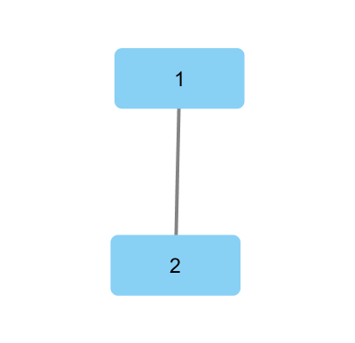

# digraph_export
 #

Copyright (c) 2018 John Krukoff

__Version:__ 1.0.0

__Authors:__ John Krukoff ([`github@cultist.org`](mailto:github@cultist.org)).


### Overview ###


The digraph_export module provides a set of utility functions for converting
digraph graphs into common graph file formats. In addition, graph viewing
programs can be launched to view those files.

It is intended for use in debugging and visualizing graphs, not for
customizing the export process. As such, no graph features beyond digraph's
built in ID and label constructs are supported.


### Getting Started ###

This library is published to [hex.pm](https://hex.pm) as [digraph_export](https://hex.pm/packages/digraph_export). If you're
using [rebar3](https://www.rebar3.org/) as your build tool, it can
be added as a dependency to your rebar.config as follows:

```

{deps, [{digraph_export}]}.
```


### Usage ###

```

1> Graph = digraph:new(),
    digraph:add_vertex(Graph, 1, first),
    digraph:add_vertex(Graph, 2, second),
    digraph:add_edge(Graph, edge, 1, 2, connected).
2> GraphML = digraph_export:convert(Graph, graphml).
3> digraph_export:view(GraphML, graphml, cytoscape).
```




#### Formats ####

The following output file formats are supported:

* [dot](http://www.graphviz.org/doc/info/lang.md)

* [graphml](http://graphml.graphdrawing.org/)


#### Programs ####

If installed and  present on the current $PATH, the following programs can be
launched:

* [gephi](https://gephi.org/)

* [cytoscape](https://cytoscape.org/)


### Contributing ###

Please fork the repo and submit a PR. Tests are run via:

```

rebar3 as test eunit, proper
```

Documentation is autogenerated using edown and edoc via:

```

rebar3 as markdown edoc
```

The application has only been tested with Erlang/OTP 21 on Windows 10. Reports
of success (or failure!) on other versions and operating systems are
appreciated.


### Lineage ###

This module was created while working on an [exercism.io
erlang exercise](https://exercism.io/tracks/erlang/exercises/connect/solutions/caf32f0478c442dcb4e77db024c5d375), where I had managed to incorrectly create the underlying
graph. Once I finally found the bug, I realized it would have been quite a bit
easier if I'd been able to visualize the graph I'd created.


### Attribution ###
Image by [Fir0002](https://commons.wikimedia.org/wiki/File:Dewy_spider_web.jpg)
CC BY-SA 3.0 [`https://creativecommons.org/licenses/by/3.0/deed.en`](https://creativecommons.org/licenses/by/3.0/deed.en)


## Modules ##


<table width="100%" border="0" summary="list of modules">
<tr><td><a href="digraph_export.md" class="module">digraph_export</a></td></tr></table>

